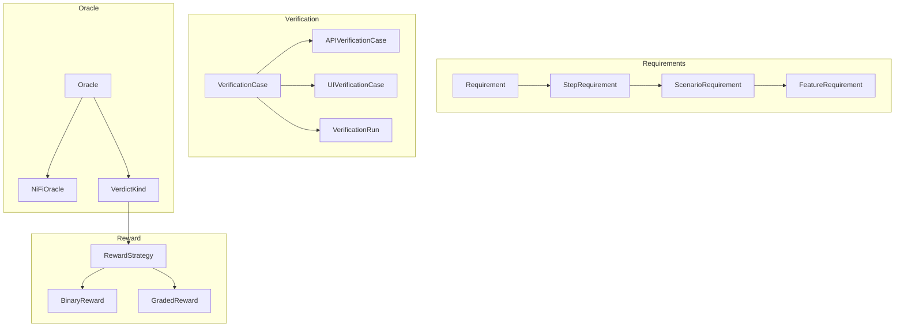

# Gaius RASE VM (Verifier Model)

Verification Model defining requirements and verification cases for RLVR (Reinforcement Learning with Verifiable Reward). This is the core oracle infrastructure that enables verifiable agent training.

## Architecture



## Module Structure

```
vm/
├── __init__.py         # Module exports
├── requirements.py     # Requirement, StepRequirement, ScenarioRequirement
├── verification.py     # VerdictKind, VerificationCase, VerificationResult
└── oracle.py           # Oracle, NiFiOracle, RewardStrategy, compute_reward
```

## Requirements

Declarative specifications of expected behavior:

### StepRequirement

Atomic requirement from a BDD step:

```python
from gaius.rase.vm import StepRequirement

req = StepRequirement(
    id=TraceableId.from_bdd("basic_flows", scenario="CreateFlow", step=1),
    step_type=StepType.WHEN,
    text="I drag a GetFile processor to the canvas",
    precondition="Canvas is empty",
    postcondition="GetFile processor exists on canvas",
)
```

### ScenarioRequirement

Composite requirement grouping steps:

```python
from gaius.rase.vm import ScenarioRequirement, derive_requirements_from_scenario

scenario_req = ScenarioRequirement(
    id=TraceableId.from_bdd("basic_flows", scenario="CreateFlow"),
    scenario_name="Create Basic Flow",
    step_requirements=[step1, step2, step3],
    success_criteria="All processors created and connected",
)

# Or derive from BDD scenario
scenario_req = derive_requirements_from_scenario(scenario)
```

### FeatureRequirement

Top-level requirement grouping scenarios:

```python
from gaius.rase.vm import FeatureRequirement

feature_req = FeatureRequirement(
    id=TraceableId.from_bdd("basic_flows"),
    feature_name="Basic NiFi Flows",
    scenario_requirements=[scenario1, scenario2],
    rationale="Core flow creation capabilities",
)
```

## Verification

### VerdictKind

Only four possible outcomes:

```python
from gaius.rase.vm import VerdictKind

class VerdictKind(Enum):
    PASS = "pass"           # All constraints satisfied
    FAIL = "fail"           # One or more constraints violated
    INCONCLUSIVE = "inconclusive"  # Cannot determine (timeout, missing data)
    ERROR = "error"         # Verification itself failed
```

### VerificationCase

Test that verifies requirements:

```python
from gaius.rase.vm import VerificationCase, APIVerificationCase

case = APIVerificationCase(
    id=TraceableId.generate(scheme="rase", prefix="verify"),
    name="Verify CreateFlow",
    requirement_id=scenario_req.id,
    setup="Clear canvas",
    execute="Run scenario steps",
    verify=[
        Constraint.ProcessorExists("GetFile"),
        Constraint.ProcessorExists("PutFile"),
        Constraint.ConnectionExists("GetFile", "PutFile"),
    ],
    teardown="Clear canvas",
)
```

### VerificationResult

Outcome of running a verification case:

```python
from gaius.rase.vm import VerificationResult

result = VerificationResult(
    case_id=case.id,
    verdict=VerdictKind.PASS,
    accuracy=1.0,  # All constraints passed
    constraint_results=[
        ConstraintResult.success("ProcessorExists(GetFile)"),
        ConstraintResult.success("ProcessorExists(PutFile)"),
        ConstraintResult.success("ConnectionExists(GetFile, PutFile)"),
    ],
    evidence=api_response,
    duration_ms=150,
)
```

### VerificationRun

Execution record with metadata:

```python
from gaius.rase.vm import VerificationRun

run = VerificationRun(
    id=uuid4(),
    case=case,
    result=result,
    started_at=datetime.now(),
    completed_at=datetime.now() + timedelta(ms=150),
    agent_id="leader",
    agent_version="v1.2.3",
)
```

## Oracle

Ground truth verification:

### NiFiOracle

Uses NiFi API (not UI) for verification:

```python
from gaius.rase.vm import NiFiOracle

oracle = NiFiOracle(nifi_client)

# Verify scenario execution
result = await oracle.verify(
    scenario=scenario,
    agent_trace=ui_trace,
    timeout_seconds=30,
)

print(f"Verdict: {result.verdict}")
print(f"Accuracy: {result.accuracy:.2%}")
```

### Oracle Invariants

1. **API is truth**: Oracle uses REST API, never UI observations
2. **UI traces are targets**: Agent UI actions are what we're training
3. **Temporal ordering**: Oracle checks post-conditions after agent completes

## Reward Computation

### RewardStrategy

Base class for reward computation:

```python
from gaius.rase.vm import RewardStrategy, BinaryReward, GradedReward

# Binary: sparse signal (0 or 1)
binary = BinaryReward()
reward = binary.compute(result)  # 1.0 if PASS, 0.0 otherwise

# Graded: dense signal with partial credit
graded = GradedReward(
    pass_weight=1.0,
    partial_weight=0.5,
    fail_weight=0.0,
)
reward = graded.compute(result)  # Proportional to accuracy
```

### compute_reward

Convenience function:

```python
from gaius.rase.vm import compute_reward

reward = compute_reward(
    result=verification_result,
    strategy="graded",  # or "binary"
)

print(f"Reward: {reward:.3f}")
```

## SysML v2 Alignment

| SysML v2 Concept | RASE VM Implementation |
|------------------|------------------------|
| `requirement def` | `Requirement`, `ScenarioRequirement` |
| `verification def` | `VerificationCase` |
| `objective` | `VerificationObjective` |
| `satisfy` | `VerificationResult.verdict == PASS` |
| `verify` | `Oracle.verify()` |

## Call Graph

```
# Verification Path
agents.evolution.DaemonOracle.verify()
  └─→ rase.vm.NiFiOracle.verify()
      ├─→ [for each constraint in case.verify]
      │   └─→ ssm.Constraint.evaluate(state)
      │       └─→ ConstraintResult
      └─→ aggregate_results()
          └─→ VerificationResult(verdict, accuracy)

# Reward Path
agents.evolution.engine.EvolutionEngine.run_cycle()
  └─→ [after verification]
      └─→ rase.vm.compute_reward(result, strategy)
          └─→ RewardStrategy.compute(result)
              └─→ float (reward signal)

# Requirement Derivation Path
rase.vm.derive_requirements_from_scenario()
  └─→ [for each step in scenario.steps]
      └─→ StepRequirement(step)
          └─→ ScenarioRequirement(step_requirements)
```

## Data Flow

```
┌─────────────────────────────────────────────────────────────────────┐
│                    Agent Execution                                   │
│         UI trace from agent performing scenario                      │
└─────────────────────────────────┬───────────────────────────────────┘
                                  │
                                  ▼
┌─────────────────────────────────────────────────────────────────────┐
│                    Oracle.verify()                                   │
│              API call to NiFi → ground truth state                   │
└─────────────────────────────────┬───────────────────────────────────┘
                                  │
                                  ▼
┌─────────────────────────────────────────────────────────────────────┐
│                    Constraint Evaluation                             │
│         [for each constraint] → ConstraintResult                     │
└─────────────────────────────────┬───────────────────────────────────┘
                                  │
              ┌───────────────────┴───────────────────┐
              ▼                                       ▼
     ┌──────────────┐                        ┌──────────────┐
     │ VerdictKind  │                        │   Accuracy   │
     │ PASS/FAIL/...│                        │   0.0-1.0    │
     └──────┬───────┘                        └──────┬───────┘
            │                                       │
            └───────────────────┬───────────────────┘
                                ▼
┌─────────────────────────────────────────────────────────────────────┐
│                    VerificationResult                                │
│              verdict + accuracy + constraint_results                 │
└─────────────────────────────────┬───────────────────────────────────┘
                                  │
                                  ▼
┌─────────────────────────────────────────────────────────────────────┐
│                    compute_reward()                                  │
│              strategy.compute(result) → float                        │
└─────────────────────────────────────────────────────────────────────┘
```

## Integration Points

| Component | Uses | Used By | Integration |
|-----------|------|---------|-------------|
| `NiFiOracle` | nifi_client, ssm.Constraint | evolution.DaemonOracle | `verify()` |
| `VerificationCase` | Constraint | Oracle | Verification definition |
| `VerificationResult` | VerdictKind | Oracle, evolution | Verification outcome |
| `compute_reward()` | RewardStrategy | evolution.engine | Reward computation |
| `derive_requirements_from_scenario()` | osm.Scenario | mcp_server | Requirement extraction |

## See Also

- [Parent README](../README.md) — RASE overview
- [SSM README](../ssm/README.md) — System state and constraints
- [OSM README](../osm/README.md) — Scenario definitions
- [Evolution README](../../agents/evolution/README.md) — Training integration

---

<!-- GAI:META
module: gaius.rase.vm
layer: L6-verification
key_types: [Requirement, StepRequirement, ScenarioRequirement, FeatureRequirement, VerdictKind, VerificationObjective, VerificationCase, APIVerificationCase, UIVerificationCase, VerificationResult, VerificationRun, Oracle, NiFiOracle, RewardStrategy, BinaryReward, GradedReward]
key_funcs: [verify, compute_reward, derive_requirements_from_scenario]
submodules: []
depends: [ssm, osm, nifi_client]
dependents: [agents.evolution, mcp_server]
config_keys: []
env_vars: []
grpc_services: []
sysml_v2_mapping:
  requirement_def: [Requirement, ScenarioRequirement]
  verification_def: VerificationCase
  objective: VerificationObjective
  satisfy: "verdict == PASS"
  verify: Oracle.verify
verdict_kinds: [PASS, FAIL, INCONCLUSIVE, ERROR]
reward_strategies: [binary, graded]
invariants:
  - "API is truth, UI traces are training targets"
  - "Accuracy is always 0.0-1.0"
  - "Only four verdict outcomes"
call_paths:
  verify: evolution.DaemonOracle.verify→NiFiOracle.verify→Constraint.evaluate→VerificationResult
  reward: evolution.engine→compute_reward→RewardStrategy.compute→float
  derive: derive_requirements_from_scenario→StepRequirement→ScenarioRequirement
test_cmds:
  verify: 'uv run gaius-cli --cmd "/rase verify research-synthesis-verification"'
guru_codes: [VM.00001.ORACLE_TIMEOUT, VM.00002.CONSTRAINT_FAIL]
fail_fast: true
-->
