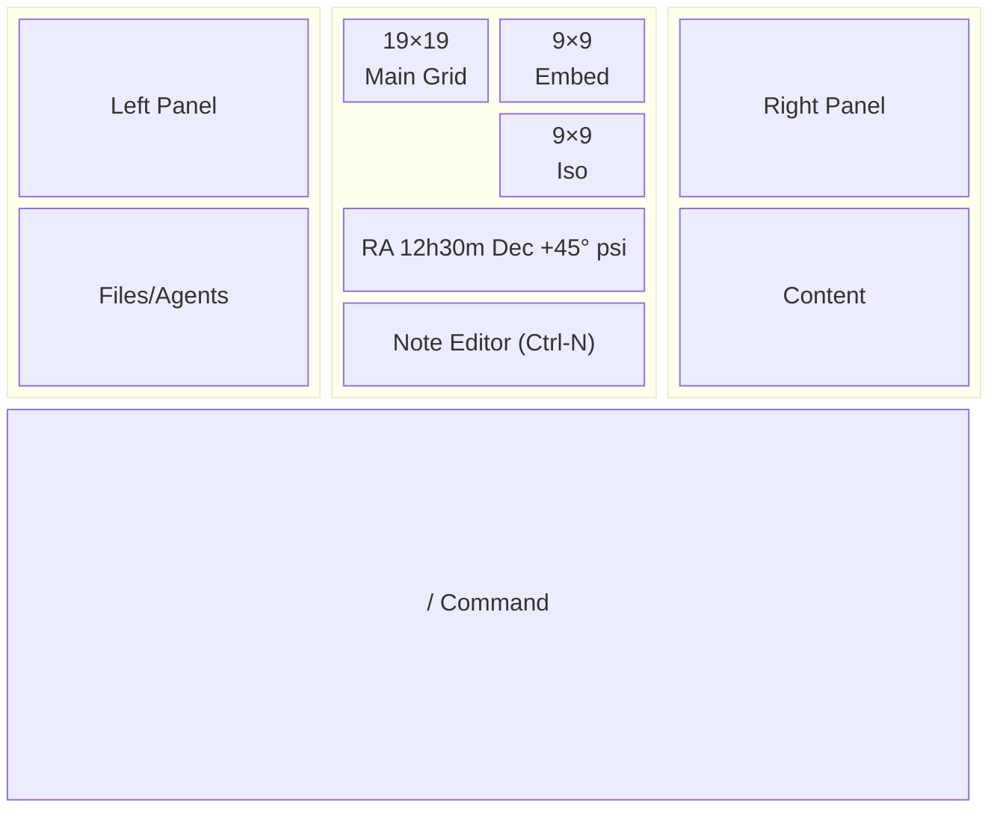
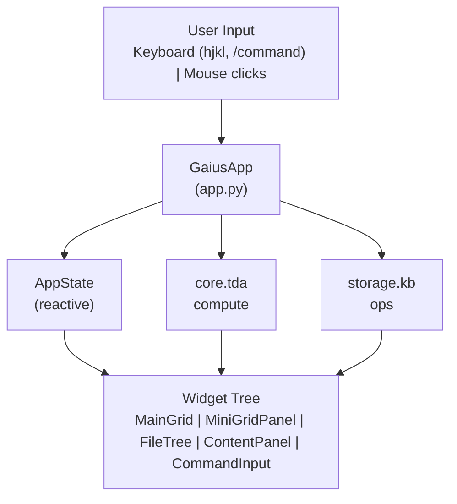

# Gaius Widgets

Textual-based TUI components for the Gaius spatial intelligence interface. This module provides the visual primitives for grid navigation, panel management, and interactive command input.

## Layout



## Module Structure

```
widgets/
├── __init__.py             # Module exports
├── grid.py                 # MainGrid (19×19)
├── minigrid.py             # MiniGrid (9×9)
├── filetree.py             # FileTree navigation
├── content.py              # ContentPanel (right)
├── command.py              # CommandInput (bottom)
├── location.py             # LocationIndicator
├── note_editor.py          # Inline note editing
├── graph_view.py           # Wiki-link graph
├── think_panel.py          # Reasoning traces
├── evolution_panel.py      # Evolution status
├── init_panel.py           # Initialization progress
├── observe_panel.py        # Health metrics
├── splash.py               # Splash screen
└── connection_indicator.py # gRPC status
```

## Core Widgets

### MainGrid (19×19)

The primary visualization displaying KB documents on a Go board grid:

```python
from gaius.widgets.grid import MainGrid

grid = MainGrid(state=app_state)
```

**Coordinate System**: Follows Go board conventions (A1–T19, omitting I per tradition). Star points (hoshi) appear at standard positions:

```
   A B C D E F G H J K L M N O P Q R S T
19 · · · · · · · · · · · · · · · · · · · 19
18 · · · · · · · · · · · · · · · · · · · 18
...
16 · · · + · · · · · + · · · · · + · · · 16  ← Star points
...
 1 · · · · · · · · · · · · · · · · · · ·  1
   A B C D E F G H J K L M N O P Q R S T
```

**Visual Elements**:
- Document markers (filled circles) at grid positions
- Cursor position with vim-style navigation (hjkl)
- View mode overlays (Topology, Geometry, Dynamics, Agents)
- Optional candidate markers for pending positions

### MiniGrid (9×9)

Orthographic projections providing detailed local views:

```python
from gaius.widgets.minigrid import MiniGrid

embed_view = MiniGrid(title="Embed", data=similarity_matrix)
iso_view = MiniGrid(title="Iso", data=curvature_matrix)
```

**Views**:
- **Embed**: Cosine similarity spotlight centered on cursor position
- **Iso**: Elevation map with four selectable modes (kappa, pi, sigma, beta)

**Unicode Intensity Scale**:

| Value Range | Character | Interpretation |
|-------------|-----------|----------------|
| > 0.8 | █ | Very high intensity |
| > 0.6 | ▓ | High intensity |
| > 0.4 | ▒ | Medium intensity |
| > 0.2 | ░ | Low intensity |
| > 0.05 | · | Minimal |
| ≤ 0.05 | (space) | None |

### FileTree

Plan 9-inspired file navigation (Pike et al., 1995):

```python
from gaius.widgets.filetree import FileTree

tree = FileTree(root_path="build/dev")
```

**Structure**:
```
/agents/
├── leader
├── risk
├── optimizer
└── planner
/files/
├── current/
│   └── topics/
└── scratch/
    └── 2025-12-13/
```

Following the Plan 9 philosophy, agents are represented as files, enabling uniform interaction patterns.

### ContentPanel

Right panel displaying document contents and agent output:

```python
from gaius.widgets.content import ContentPanel

panel = ContentPanel(state=app_state)
```

**Features**:
- Markdown rendering with syntax highlighting
- Wikilink support (`[[document]]` navigation)
- Agent response display
- Position context information

### CommandInput

Slash command input following slash-command conventions:

```python
from gaius.widgets.command import CommandInput, CommandSubmitted

cmd = CommandInput()
```

**Commands**:
- `/search <query>` — Search KB documents
- `/domain <name>` — Set domain focus
- `/swarm [domain]` — Execute multi-agent analysis
- `/explain [pos]` — Explain grid position
- `/tda` — Display topological features
- `/fmea` — FMEA health summary

### LocationIndicator

Celestial-style position display:

```
RA 12h30m Dec +45° psi=0.85
```

Components:
- Position as Right Ascension and Declination (grid coordinates mapped to celestial convention)
- psi: Relevance score for current position
- Optional Iso mode indicator (kappa/pi/sigma/beta)

## Panel Widgets

### ThinkPanel

Displays reasoning traces from agent operations:

```python
from gaius.widgets.think_panel import ThinkPanel

panel = ThinkPanel()
panel.add_trace(trace)
```

**Trace Structure**:
```
[12:34:56] search "persistent homology"
├── 5 sources consulted
├── cot_reflection technique
└── 1,234 tokens (450ms)
```

### EvolutionPanel

Evolution daemon monitoring:

**Displays**:
- Current cycle status and agent being optimized
- Agent performance scores over time
- Improvement trends
- GPU resource utilization

### InitPanel

Initialization progress during startup:

**Phases**:
1. TELEMETRY — OpenTelemetry setup
2. BACKENDS — optillm/vLLM controller initialization
3. ORCHESTRATOR — Endpoint management
4. ENDPOINTS — vLLM model loading (~240s for 70B models)
5. COMPLETE — Ready for operation

### ObservePanel

Operational health metrics:

**Metrics**:
- GPU memory utilization and temperature
- Endpoint health status
- Request latency percentiles
- Queue depth and throughput

### GraphView

Wiki-link graph visualization:

**Features**:
- Force-directed layout for document relationships
- Connected node highlighting
- Link-based navigation

## Key Bindings

| Key | Action |
|-----|--------|
| `hjkl` | Navigate cursor (vim-style) |
| `v` | Cycle view modes (Go → Theta → Swarm) |
| `o` | Cycle overlay modes |
| `i` | Cycle Iso modes (kappa → pi → sigma → beta) |
| `g` | Toggle center panel (Graph → Think → Evolution) |
| `[` | Toggle left panel |
| `]` | Toggle right panel |
| `\` | Toggle both panels |
| `/` | Enter command mode |
| `?` | Show help |
| `t` | Tenuki (jump to strategic position) |
| `Ctrl-N` | Open note editor |
| `q` | Quit |

## Reactive State

Widgets react to `AppState` changes via Textual's reactive system:

```python
from gaius.core.state import AppState, ViewMode, OverlayMode

state = AppState()
state.view_mode = ViewMode.SWARM
state.overlay_mode = OverlayMode.TOPOLOGY
state.cursor_x = 9
state.cursor_y = 9
```

**Reactive Properties**:
- `cursor_x`, `cursor_y` — Grid cursor position
- `view_mode` — Active view (Go, Theta, Swarm)
- `overlay_mode` — Active overlay (Topology, Geometry, etc.)
- `iso_mode` — Iso view mode (kappa, pi, sigma, beta)
- `center_panel_mode` — Center panel state

## Styling

CSS-in-Python via Textual (Holman, 2023):

```python
class MainGrid(Widget):
    DEFAULT_CSS = """
    MainGrid {
        width: 100%;
        height: 100%;
        min-width: 40;
        min-height: 21;
    }
    """
```

**Color Scheme**:
- `$primary` — Main accent color
- `$success` — Positive indicators
- `$warning` — Attention required
- `$error` — Errors and failures
- `dim` — Subtle elements

## References

- Holman, W. (2023). *Textual: A TUI Framework for Python*. https://textual.textualize.io/
- Pike, R., Presotto, D., Dorward, S., Flandrena, B., Thompson, K., Trickey, H., & Winterbottom, P. (1995). Plan 9 from Bell Labs. *Computing Systems*, 8(3), 221–254.

## Call Graph

```
# TUI Startup Path
launcher.py:main()
  └─→ GaiusApp.compose()
      ├─→ MainGrid(state=app_state)
      ├─→ MiniGridPanel([embed_view, iso_view])
      ├─→ FileTree(root_path=kb_root)
      ├─→ ContentPanel(state=app_state)
      ├─→ CommandInput()
      └─→ LocationIndicator()

# Cursor Navigation Path
MainGrid.key_j()  # vim-style down
  └─→ app_state.cursor_y += 1
      └─→ [reactive] MainGrid.watch_cursor_y()
          └─→ self.refresh()
          └─→ MiniGridPanel.update_views(cursor_x, cursor_y)

# Command Execution Path
CommandInput.action_submit()
  └─→ self.post_message(CommandSubmitted(text))
      └─→ GaiusApp.on_command_submitted()
          ├─→ /search → storage.kb_ops.search_kb()
          ├─→ /swarm → agents.swarm.run_swarm()
          ├─→ /explain → core.projection.explain_position()
          └─→ /tda → core.tda.compute_tda()

# Content Loading Path
FileTree.on_node_selected()
  └─→ self.post_message(FileSelected(path))
      └─→ ContentPanel.load_file(path)
          └─→ storage.kb_ops.read_kb(path)
              └─→ ContentPanel.update(content)
```

## Data Flow



## Integration Points

| Widget | Uses | Reacts To | Messages |
|--------|------|-----------|----------|
| `MainGrid` | AppState, projection | cursor_x, cursor_y, view_mode, overlay_mode | — |
| `MiniGridPanel` | core.geometry | cursor position | — |
| `FileTree` | storage.kb_ops | — | `FileSelected` |
| `ContentPanel` | storage.kb_ops | file selection | — |
| `CommandInput` | — | — | `CommandSubmitted` |
| `LocationIndicator` | AppState | cursor position | — |
| `EvolutionPanel` | client.evolution_proxy | evolution events | — |
| `ObservePanel` | observability.sources | health metrics | — |

## See Also

- [Parent README](../README.md) — Module overview
- [Core README](../core/README.md) — State management
- [app.py](../app.py) — Main TUI application
- [Observability README](../observability/README.md) — ObservePanel metrics

---

<!-- GAI:META
module: gaius.widgets
layer: L7-widgets
key_types: [MainGrid, MiniGrid, MiniGridPanel, FileTree, ContentPanel, CommandInput, LocationIndicator, ThinkPanel, EvolutionPanel, InitPanel, ObservePanel, GraphView, NoteEditor, Splash, ConnectionIndicator]
key_funcs: []
submodules: []
depends: [core.state, core.tda, core.geometry, storage.kb_ops, client.engine_proxy, observability]
dependents: [app]
config_keys: []
env_vars: []
grpc_services: []
external_deps: [textual]
reactive_props: [cursor_x, cursor_y, view_mode, overlay_mode, iso_mode, center_panel_mode]
key_bindings:
  navigation: [h, j, k, l]
  modes: [v, o, i, g]
  panels: ["[", "]", "\\"]
  commands: ["/", "?", t, q, Ctrl-N]
call_paths:
  startup: launcher→GaiusApp.compose→[widgets]
  navigation: MainGrid.key_*→app_state.cursor_*→reactive.refresh
  command: CommandInput.action_submit→CommandSubmitted→GaiusApp.on_command
  file: FileTree.on_node_selected→FileSelected→ContentPanel.load_file
test_cmd: 'uv run gaius'
guru_codes: [WG.00001.RENDER_FAIL]
fail_fast: true
-->
